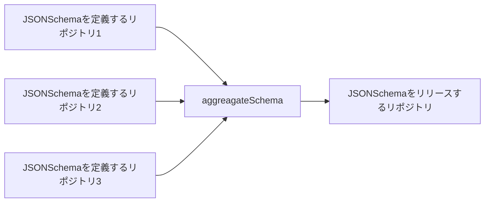

# JSON Shcema 集約
この Github Apps は組織内のリポジトリから JSON schema ファイルを集めてきて、VSCode の入力支援、型をチェックするコード、補完や正規化をするコードをターゲットとなる JSONSchema ライブラリのリポジトリに集約する。集約することによってリポジトリに跨った参照関係を解決できるようにする。リポジトリの main ブランチに commit が push されたときに動作する。ただし、リポジトリの topic に jsonschema が入っていて、リポジトリのトップレベルに jsonshcemas ディレクトリが入っている場合に限る。

## 集約
ブランチのコミットを観測し、コミットがあったリポジトリの jsonschema ディレクトリを imported/リポジトリ名/jsonschemas の下に展開する。imported/リポジトリ名/jsonschemas は展開前に一旦削除して洗い替えを行う。

## ビルド
前項の集約の結果差分があった場合はビルドを実行する。
1. リポジトリ名/jsonschemasをマージして jsonschemas ディレクトリを再構築する。jsonschemas ディレクトリはは一旦削除して洗い替えを行う。

## プルリクエスト
ビルドした結果を commit して. pushする。以下の手順となる
1. リポジトリにプルリクエストが存在しない場合は、新規に作成する。
2. 

